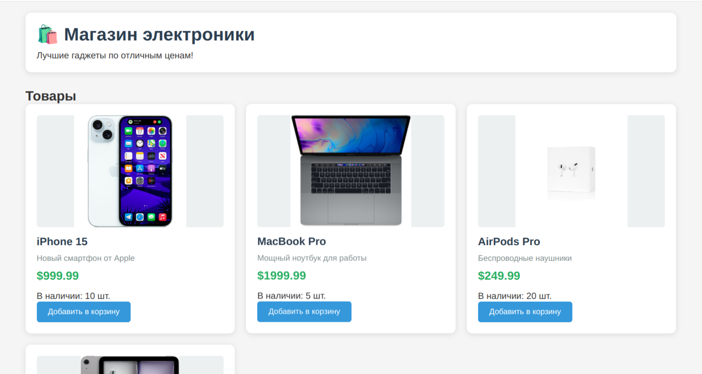

## 1\. Концепция и Бизнес-процесс

### Идея

Проект "Магазин электроники" — это простое веб-приложение для электронной коммерции. Он представляет собой витрину товаров, позволяет пользователям добавлять товары в корзину и оформлять заказ.

### Основной Бизнес-процесс (User Flow)

1.  **Загрузка страницы**: Пользователь открывает сайт. Фронтенд-сервер (`frontend/main.go`) отдает `index.html`.
2.  **Загрузка данных**: JavaScript (`script.js`) на стороне клиента выполняет два запроса к бэкенду:
      * `GET /api/products`: Получает список всех доступных товаров.
      * `GET /api/cart`: Получает текущее содержимое корзины.
3.  **Отображение (Рендеринг)**:
      * Список товаров отображается в виде карточек.
      * Товары в корзине отображаются в секции "Корзина".
4.  **Добавление в корзину**:
      * Пользователь нажимает кнопку "Добавить в корзину" у товара.
      * Выполняется запрос `POST /api/cart` с `product_id`.
      * Бэкенд добавляет товар в таблицу `cart` (или увеличивает `quantity`, если он уже там).
      * Фронтенд заново загружает (`loadCart()`) и отображает (`renderCart()`) корзину.
5.  **Удаление из корзины**:
      * Пользователь нажимает "Удалить".
      * Выполняется запрос `DELETE /api/cart/:id`.
      * Бэкенд удаляет товар из таблицы `cart`.
      * Фронтенд заново загружает и отображает корзину.
6.  **Оформление заказа**:
      * Пользователь нажимает "Оформить заказ".
      * Выполняется запрос `POST /api/checkout`.
      * Бэкенд:
          * Считывает все товары из таблицы `cart`.
          * Подсчитывает общую стоимость.
          * Создает новую запись в таблице `orders`, сохраняя состав корзины в виде JSON-строки в поле `items`.
          * **Полностью очищает** таблицу `cart`.
      * Фронтенд получает ответ об успехе, показывает сообщение и обновляет корзину (которая теперь пуста).



-----

## 2\. Схема Архитектуры

Проект использует **двухкомпонентную (decoupled) архитектуру**:

1.  **Frontend (Клиентское приложение)**:
      * Написан на Go (c использованием Gin) и служит только для **отправки статики** (`index.html`, `style.css`, `script.js`).
      * Вся логика отображения (рендеринг, управление состоянием) происходит в браузере пользователя с помощью JavaScript (`static/script.js`).
      * Получает URL бэкенда через переменную окружения `BACKEND_URL` и встраивает его в HTML.
2.  **Backend (API Сервер)**:
      * Написан на Go (c использованием Gin).
      * Предоставляет **RESTful JSON API** для управления продуктами, корзиной и заказами.
      * Взаимодействует с базой данных PostgreSQL.
3.  **Database (База данных)**:
      * PostgreSQL.
      * Хранит состояние приложения: товары, корзину и заказы.

### Поток данных (Data Flow)

1.  Браузер пользователя запрашивает `index.html` у **Frontend-сервера** (порт `:3000`).
2.  Frontend-сервер отдает HTML/CSS/JS.
3.  JavaScript в браузере выполняет API-запросы (например, `GET /api/products`) к **Backend-серверу** (порт `:8080`).
4.  Backend-сервер выполняет SQL-запросы к **БД PostgreSQL** (порт `:5432`).
5.  БД возвращает данные бэкенду.
6.  Бэкенд возвращает JSON-ответ JavaScript-клиенту.
7.  JavaScript обновляет HTML-страницу.

-----

## 3\. Схема Базы Данных (PostgreSQL)

Схема определяется в `database/database.go`.

### Таблица: `products`

Хранит каталог товаров.

```sql
CREATE TABLE IF NOT EXISTS products (
    id SERIAL PRIMARY KEY,
    name TEXT NOT NULL,
    description TEXT,
    price DECIMAL(10,2) NOT NULL,
    image_url TEXT,
    stock INTEGER DEFAULT 0,
    created_at TIMESTAMP DEFAULT CURRENT_TIMESTAMP
);
```

### Таблица: `cart`

Хранит **текущую корзину**.

*Примечание: Это серверная, персистентная корзина. Судя по коду, она **глобальная для всех пользователей**, так как нет системы аутентификации.*

```sql
CREATE TABLE IF NOT EXISTS cart (
    product_id INTEGER PRIMARY KEY,
    quantity INTEGER NOT NULL DEFAULT 0,
    created_at TIMESTAMP DEFAULT CURRENT_TIMESTAMP,
    FOREIGN KEY (product_id) REFERENCES products (id) ON DELETE CASCADE
);
```

### Таблица: `orders`

Хранит историю оформленных заказов.

*Примечание: Состав заказа (`items`) хранится в виде **JSON-строки** в текстовом поле, что является денормализацией.*

```sql
CREATE TABLE IF NOT EXISTS orders (
    id SERIAL PRIMARY KEY,
    items TEXT NOT NULL, -- JSON-строка с массивом {product_id, quantity}
    total_price DECIMAL(10,2) NOT NULL,
    created_at TIMESTAMP DEFAULT CURRENT_TIMESTAMP
);
```

-----

## 4\. Документация API Бэкенда

Базовый URL: `http://<backend_host>:8080/api`

### Товары (Products)

#### `GET /api/products`

Получает список всех товаров.

  * **Тело запроса**: нет
  * **Успешный ответ (200 OK)**:
    ```json
    [
      {
        "id": 1,
        "name": "iPhone 15",
        "description": "Новый смартфон от Apple",
        "price": 999.99,
        "image_url": "/static/images/iphone.jpg",
        "stock": 10
      },
      ...
    ]
    ```

-----

### Корзина (Cart)

#### `GET /api/cart`

Получает текущее содержимое корзины.

  * **Тело запроса**: нет
  * **Успешный ответ (200 OK)**:
    ```json
    [
      {
        "product": {
          "id": 1,
          "name": "iPhone 15",
          "description": "Новый смартфон от Apple",
          "price": 999.99,
          "image_url": "/static/images/iphone.jpg",
          "stock": 10
        },
        "quantity": 1
      },
      ...
    ]
    ```

#### `POST /api/cart`

Добавляет товар в корзину. Если товар уже в корзине, увеличивает его количество на 1.

  * **Тело запроса**:
    ```json
    {
      "product_id": 1
    }
    ```
  * **Успешный ответ (200 OK)**:
    ```json
    {
      "message": "Товар добавлен в корзину"
    }
    ```
  * **Ошибка (400 Bad Request)**:
    ```json
    {
      "error": "Товар не существует или нет в наличии"
    }
    ```

#### `DELETE /api/cart/:id`

Удаляет товар из корзины (полностью, независимо от количества).

  * **Параметр URL**: `:id` - ID товара (product\_id).
  * **Тело запроса**: нет
  * **Успешный ответ (200 OK)**:
    ```json
    {
      "message": "Товар удален из корзины"
    }
    ```

-----

### Заказы (Checkout)

#### `POST /api/checkout`

Оформляет заказ: переносит товары из корзины в новый заказ и очищает корзину.

  * **Тело запроса**: нет
  * **Успешный ответ (200 OK)**:
    ```json
    {
      "message": "Заказ оформлен",
      "total": 1249.98
    }
    ```
  * **Ошибка (400 Bad Request)**:
    ```json
    {
      "error": "Корзина пуста"
    }
    ```

-----

## 5\. Замечания и Возможные Улучшения

1.  **Отсутствие Аутентификации**: В проекте нет пользователей. Из-за этого **корзина (`cart`) является глобальной** — все, кто одновременно откроет сайт, будут видеть и изменять одну и ту же корзину.

      * **Улучшение**: Внедрить аутентификацию (например, JWT) и привязать корзину к `user_id`.

2.  **Ошибка в Бизнес-логике**: При оформлении заказа (`POST /checkout`) **не уменьшается остаток товара** на складе (поле `stock` в таблице `products`). Товары можно покупать бесконечно, пока они есть в наличии (проверка `stock > 0` есть только в `AddToCart`).

      * **Улучшение**: В транзакции `Checkout` необходимо обновить поле `stock` для каждого купленного товара (`UPDATE products SET stock = stock - ? WHERE id = ?`).

3.  **Схема Заказов**: Хранение товаров в заказе (`orders.items`) в виде `TEXT` (JSON) — это быстрое, но немасштабируемое решение. По этому полю сложно делать аналитику (например, "какой товар самый продаваемый?").

      * **Улучшение**: Создать отдельную таблицу `order_items` (связь "многие-ко-многим" между `orders` и `products`).

4.  **Управление Корзиной**: `DELETE /api/cart/:id` удаляет всю позицию, а не уменьшает `quantity` на 1. Фронтенд также не предоставляет кнопок для изменения количества.

      * **Улучшение**: Добавить ручки `PATCH /api/cart/:id` (для изменения `quantity`) и соответствующий UI на фронтенде.
